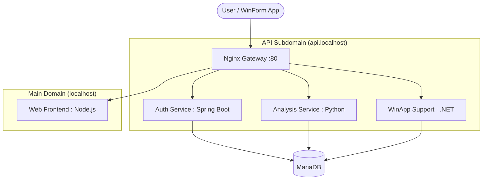

# 🚀 Semicapstone Polyglot MSA Project

대림대학교 반도체부트캠프 캡스톤 4팀 (**조아요조아요반도체가조아요**)의 반도체 공정 관리 시스템입니다.  
본 프로젝트는 확장성과 기술적 유연성을 위해 **MSA(Microservices Architecture)** 및 **Polyglot(다중 언어)** 환경으로 설계되었습니다.

---

## 🏗️ Architecture Overview

본 프로젝트는 서비스의 목적에 따라 최적의 언어와 프레임워크를 선택하여 독립적으로 운영됩니다. 모든 서비스는 **Nginx Gateway**를 통해 단일 진입점(Domain)으로 통합됩니다.



---

## 🛠️ Tech Stack & Roles

| Service | Tech Stack | Role |
| :--- | :--- | :--- |
| **Auth API** | Spring Boot (Kotlin) | 사용자 인증, JWT 발급 및 권한 관리 |
| **Analysis API** | Python (FastAPI) | 공정 데이터 분석 및 통계 알고리즘 처리 |
| **Web Frontend** | Node.js (React/Next) | 관리자용 웹 대시보드 및 서비스 모니터링 |
| **WinApp API** | .NET (ASP.NET Core) | 현장 제어용 윈도우 폼 앱 전용 통신 및 로직 |
| **Gateway** | Nginx | 도메인 기반 라우팅, SSL(HTTPS), CORS 처리 |
| **Database** | MariaDB | 공통 데이터 저장소 |

---

## 📁 Project Structure

```text
semicapstone/
├── services/               # 각 마이크로서비스 소스 코드
│   ├── auth-api/           # Spring Boot (Port 8081)
│   ├── analysis-api/       # Python (Port 8082)
│   ├── web-frontend/       # Node.js (Port 3000)
│   └── win-app-api/        # .NET (Port 8083)
├── gateway/                # Nginx Reverse Proxy 설정
├── infra/                  # DB 데이터 및 인프라 설정
├── .env                    # 서비스 환경 설정 (비밀번호, 도메인 등)
├── .env.template           # 환경 설정 템플릿 (공유용)
└── docker-compose.yml      # 통합 실행 스크립트
```

---

## 🚀 Getting Started

### 1. 환경 설정
`.env.template` 파일을 복사하여 `.env` 파일을 생성하고 필요한 값을 수정합니다. (이미 기본값이 세팅되어 있습니다.)
```bash
cp .env.template .env
```

### 2. 서버 실행
Docker를 사용하여 모든 마이크로서비스를 한 번에 실행합니다.
```bash
docker-compose up --build
```

### 3. 접속 정보 (Default)
*   **Web Dashboard:** [http://localhost](http://localhost)
*   **Auth API:** [http://api.localhost/auth](http://api.localhost/auth)
*   **Analysis API:** [http://api.localhost/analysis](http://api.localhost/analysis)
*   **WinApp API:** [http://api.localhost/winapp](http://api.localhost/winapp)

---

## 🔐 Key Features (Planned)
- **Centralized Auth:** 모든 서비스는 단일 JWT 토큰으로 인증을 공유합니다.
- **Polyglot Communication:** 서비스 간 독립성이 보장되며, 필요에 따라 개별 배포가 가능합니다.
- **Cross-Platform Support:** 웹 브라우저와 윈도우 앱 모두 동일한 API 규격을 사용합니다.

---

## 👥 Team
- **Team Name:** 조아요조아요반도체가조아요
- **Kick-off:** 2026. 05. 12
- **Goal:** 반도체 공정 데이터의 효율적인 관리 및 분석 시스템 구축
